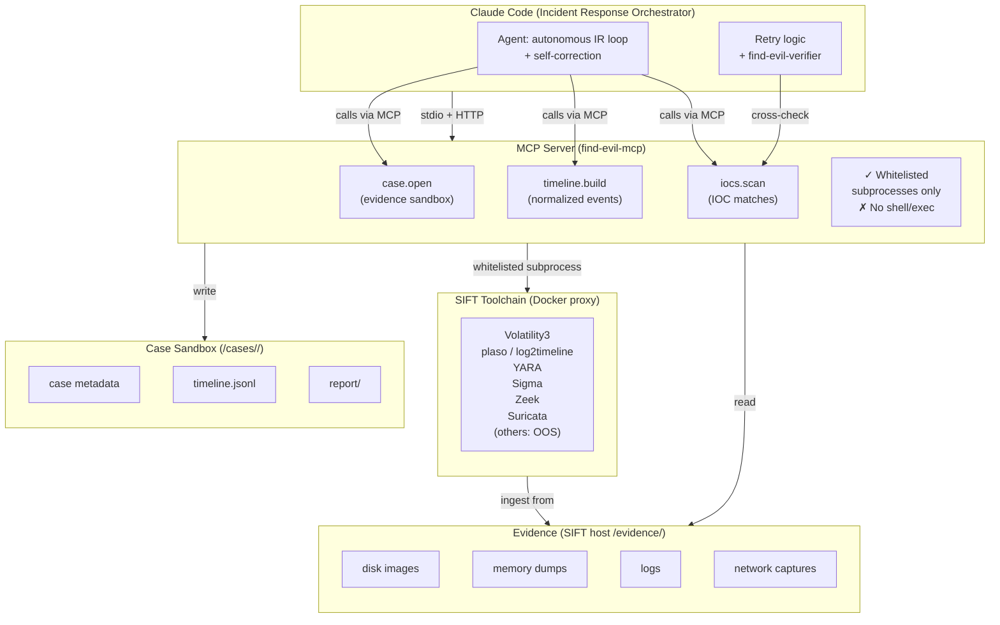
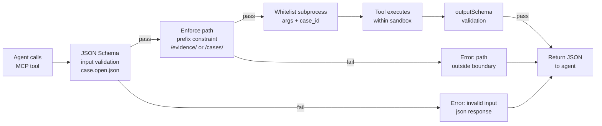
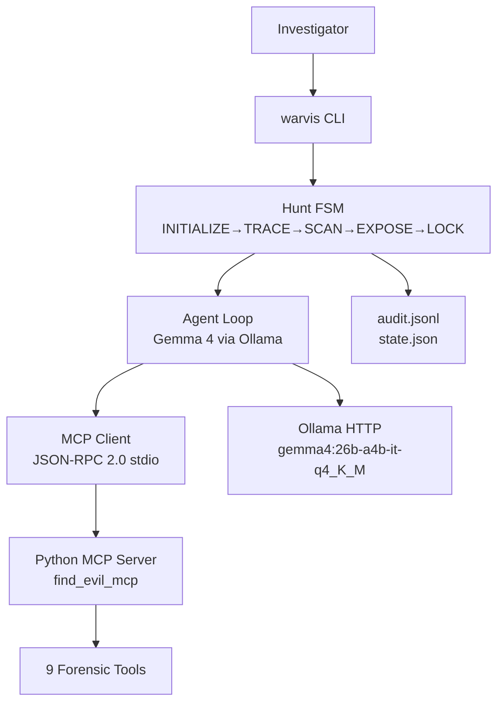

<!-- SPDX-License-Identifier: MIT -->

# FIND EVIL MCP Server — Architecture & Security Boundaries

**Version**: 0.1.0 (Phase 1-2 transition)  
**Status**: Phase 2 (9 tools: 3 Phase 1 + 6 Phase 2 implemented)  
**Phase 2 Status**: Schema complete; implementation pending (implementer phase 2)

## 1. System Architecture



## 2. Security Boundary Matrix

| Component | Allow | Deny | Evidence |
|-----------|-------|------|----------|
| **MCP input** | case_id (uuid pattern), path (regex `/evidence/` or `/cases/<id>`), enum params | shell, eval, arbitrary code, `/etc`, `/home`, outside sandbox | JSON Schema with `pattern`, `enum`, `oneOf` constraints |
| **MCP output** | structured JSON only, sandbox-relative paths | raw stdout, binary blobs, absolute paths outside `/cases/` | outputSchema enforces JSON, no `$ref` to external schemas |
| **File read** | `/evidence/*` (SIFT host perspective), `/cases/<case_id>/*` (sandbox) | `/etc`, `/root`, `/tmp` outside sandbox, network egress | case.open enforces `/evidence/` prefix; tool sandbox has read-only mount on evidence |
| **File write** | `/cases/<case_id>/report/` (structured JSON only) | anywhere else; direct write to evidence | report.append (Phase 2) restricted to report/ subdir |
| **Subprocess** | plaso, log2timeline, yara, sigma, volatility3, zeek, suricata (whitelist only) | bash, sh, python -c, perl, ruby -e, nc, curl | wrapper scripts call tools with fixed args + case_id, no user shell pass-through |
| **Network** | none (except SIFT Docker proxy localhost) | external HTTP/DNS/SSH | No socket syscalls in sandbox; proxy-only via Docker bridge |

## 3. Capability Handshake (Server Info)

When the orchestrator connects, the MCP server responds with this capability manifest:

```json
{
  "server_info": {
    "name": "find-evil-mcp",
    "version": "0.1.0",
    "description": "Forensic evidence processing orchestration via SIFT toolchain"
  },
  "capabilities": {
    "tools": [
      {
        "name": "case.open",
        "version": "0.1.0",
        "description": "Register and sandbox forensic evidence source",
        "schema_ref": "harness/find-evil/mcp-schema/case.open.json",
        "phase": "1"
      },
      {
        "name": "timeline.build",
        "version": "0.1.0",
        "description": "Construct normalized forensic timeline from case evidence",
        "schema_ref": "harness/find-evil/mcp-schema/timeline.build.json",
        "phase": "1"
      },
      {
        "name": "iocs.scan",
        "version": "0.1.0",
        "description": "Scan case evidence against YARA/Sigma IOC rules",
        "schema_ref": "harness/find-evil/mcp-schema/iocs.scan.json",
        "phase": "1"
      },
      {
        "name": "memory.process_list",
        "version": "0.1.0",
        "description": "Extract process list from memory dump (Volatility3)",
        "schema_ref": "harness/find-evil/mcp-schema/memory.process_list.json",
        "phase": "2"
      },
      {
        "name": "memory.malfind",
        "version": "0.1.0",
        "description": "Detect injected/suspicious memory regions (Volatility3)",
        "schema_ref": "harness/find-evil/mcp-schema/memory.malfind.json",
        "phase": "2"
      },
      {
        "name": "net.flow_summary",
        "version": "0.1.0",
        "description": "Extract and summarize network flows from PCAP (Zeek/Suricata)",
        "schema_ref": "harness/find-evil/mcp-schema/net.flow_summary.json",
        "phase": "2"
      },
      {
        "name": "log.query",
        "version": "0.1.0",
        "description": "Query forensic timeline and logs with structured filters",
        "schema_ref": "harness/find-evil/mcp-schema/log.query.json",
        "phase": "2"
      },
      {
        "name": "report.append",
        "version": "0.1.0",
        "description": "Append structured finding to case report with hash chain integrity",
        "schema_ref": "harness/find-evil/mcp-schema/report.append.json",
        "phase": "2"
      },
      {
        "name": "verify.cross_check",
        "version": "0.1.0",
        "description": "Re-verify findings against multiple sources for confidence scoring",
        "schema_ref": "harness/find-evil/mcp-schema/verify.cross_check.json",
        "phase": "2"
      }
    ],
    "constraints": {
      "sandbox": "/cases/<case_id>/",
      "evidence_host_path": "/evidence/",
      "no_shell": true,
      "no_eval": true,
      "json_only_output": true,
      "subprocess_whitelist": ["plaso", "log2timeline", "yara", "sigma", "volatility3", "zeek", "suricata"]
    }
  }
}
```

## 4. Input/Output Validation Flow



## 5. Phase 1 Tool Specifications

### 5.1 case.open (evidence sandbox)

**Purpose**: Register a forensic evidence source and create an isolated case workspace.

**Input constraints**:
- Exactly one of: `image_path`, `mem_path`, `pcap_path`, `logdir_path`
- All paths match regex `^/evidence/[a-zA-Z0-9._/-]+$` (SIFT host absolute)
- No symlink traversal or `..` sequences allowed

**Output**:
- `case_id`: UUID v4 (immutable case namespace)
- `sandbox_root`: `/cases/<case_id>/` (case working directory)
- `accepted_inputs`: array of {kind, path} for audit trail

**Side effects**:
- Creates `/cases/<case_id>/` directory tree (owned by orchestrator)
- Creates `/cases/<case_id>/report/` subdirectory for findings
- Registers case metadata in local registry (JSON file)

**Error handling**:
- If evidence source unreachable: return 404-equivalent JSON error
- If sandbox creation fails: return 500-equivalent JSON error
- All errors are structured JSON; no exception stack traces

### 5.2 timeline.build (normalized forensic timeline)

**Purpose**: De-duplicate and merge filesystem, memory, and log events into a canonical timeline.

**Input constraints**:
- `case_id`: must be valid UUID v4 from prior `case.open` call
- `source_filter`: enum {disk, memory, logs, network, all} (default: all)
- `since`, `until`: ISO 8601 timestamps (optional; filter events by time range)

**Output**:
- `timeline_path`: `/cases/<case_id>/timeline.jsonl` (JSON-Lines, one event per line)
- `event_count`: total events after de-duplication
- `tool_used`: enum {plaso, log2timeline}
- `generated_at`: ISO 8601 completion timestamp
- `sources_processed`: list of actual sources included

**JSON-Lines schema (per event)**:
```json
{
  "timestamp": "ISO 8601",
  "source": "disk|memory|logs|network",
  "event_type": "file_access|process_exec|network_conn|...",
  "description": "human-readable event summary",
  "artifacts": [{"type": "path|pid|ip", "value": "string"}],
  "severity": "info|low|medium|high"
}
```

**Side effects**:
- Writes `/cases/<case_id>/timeline.jsonl`
- Calls SIFT subprocess `plaso` or `log2timeline` with whitelisted args
- No direct file writes outside `/cases/<case_id>/`

### 5.3 iocs.scan (indicator-of-compromise detection)

**Purpose**: Scan case evidence against threat signatures (YARA rules or Sigma log detection rules).

**Input constraints**:
- `case_id`: valid UUID v4 from prior `case.open`
- `ruleset`: enum {yara_default, yara_custom, sigma}
  - `yara_default`: SIFT bundled YARA rules
  - `yara_custom`: user-supplied custom rules (uploaded via separate process; Phase 2)
  - `sigma`: log detection via Sigma rules
- `target_glob`: optional sandbox-relative glob pattern
  - Pattern must NOT start with `/` or contain `..`
  - Examples: `memory/*`, `disk_image.001`, `logs/**/*.txt`
  - Default: entire sandbox

**Output**:
- `scan_id`: UUID v4 (scan run identifier)
- `matches`: array of {rule, path, offset, severity, context}
  - `rule`: matched rule name
  - `path`: sandbox-relative path to matched file
  - `offset`: byte offset of match (0 if N/A)
  - `severity`: enum {info, low, medium, high, critical}
  - `context`: optional 256-byte snippet around match
- `scanned_files`: count of files examined
- `tool_used`: enum {yara, sigma}
- `generated_at`: ISO 8601 timestamp

**Side effects**:
- Calls SIFT subprocess `yara` or `sigma` with args: `--case_id <case_id> --ruleset <ruleset> [--target <glob>]`
- Reads `/cases/<case_id>/` and referenced `/evidence/` paths (read-only)
- No write operations

## 6. Phase 2 Tools (Schema Complete — Implementation Pending)

The following 6 tools were added in Phase 2 schema (2026-04-30). Implementation (subprocess integration) pending implementer phase 2 (2026-05-21 → 2026-06-01):

| Tool | Purpose | Key Input | Key Output | Subprocess |
|------|---------|-----------|------------|------------|
| `memory.process_list` | Extract process list from memory dump | case_id, kdbg_offset? | array of {pid, ppid, name, create_time, exit_time?, suspicious_flags[]} | volatility3 |
| `memory.malfind` | Detect injected/suspicious memory regions | case_id, pid? | array of {pid, vad_start, vad_end, protection, yara_hits[], severity} | volatility3 |
| `net.flow_summary` | Summarize network flows from PCAP | case_id, pcap_id, top_n? | array of {src_ip, dst_ip, src_port, dst_port, proto, bytes, packets, suspicious_flags[]} | zeek, suricata |
| `log.query` | Query timeline/logs with structured filters | case_id, q, source?, since?, until?, limit? | array of {timestamp, source, host?, user?, level?, message, raw_offset} | log2timeline, plaso-query, sigma |
| `report.append` | Append finding with hash chain integrity | case_id, finding{title, severity, narrative, evidence[], mitre_attack[]?} | {finding_id, appended_at, report_path, prev_hash, this_hash} | none (internal write only) |
| `verify.cross_check` | Re-verify finding via cross-check | case_id, finding_id, method? | {agreements[], disagreements[], confidence, verdict, tool_used[], generated_at} | none (internal read-only) |

All 6 Phase 2 schema files created in `harness/find-evil/mcp-schema/` with full input/output validation and security constraints.

## 7. Non-Goals & Out of Scope

- ❌ Shell or exec MCP tools (architectural constraint, not prompt guard)
- ❌ Arbitrary file read/write outside `/cases/<id>/` and `/evidence/`
- ❌ Generic subprocess wrappers (all subprocess calls whitelisted by name)
- ❌ Smart-contract analysis (FIND EVIL is malware DFIR, not DeFi audit)
- ❌ Cloud deployment or multi-tenant isolation (Phase 1 is local-only)
- ❌ GPU inference (NFR: CPU-only)

## 8. Validation & Testing

**Capability handshake test** (`make -C harness/find-evil mcp-conformance`):
1. Server reports correct tool names (9 tools), versions, phases
2. All 9 schema files validate against JSON Schema draft-07
3. No `$ref` to external or malicious schemas
4. `additionalProperties: false` on all input/output objects
5. Path patterns enforce sandbox boundaries (`/cases/<id>/`, `/evidence/`)
6. Subprocess whitelist enforced: plaso, log2timeline, yara, sigma, volatility3, zeek, suricata

**Phase 1 fixture test** (2026-05-20 — implementer responsibility):
- Load test disk image with known malware sample
- `case.open(image_path)` → case_id + sandbox_root
- `timeline.build(case_id)` → ≥10 events in timeline.jsonl
- `iocs.scan(case_id, ruleset="yara_default")` → ≥1 match from bundled YARA rules
- All outputs validate against outputSchema

**Phase 2 fixture test** (2026-06-01 — implementer responsibility):
- `memory.process_list(case_id)` → process array with timestamps and suspicion flags
- `memory.malfind(case_id)` → findings with VAD regions and YARA hits
- `net.flow_summary(case_id, pcap_id)` → flow array sorted by bytes, top_n limit enforced
- `log.query(case_id, q="malware")` → log hits with truncation flag, no shell injection
- `report.append(case_id, finding)` → finding_id + hash chain (prev_hash, this_hash)
- `verify.cross_check(case_id, finding_id)` → confidence score, verdict enum validation

## 9. Subprocess Execution Model

All SIFT tool invocations use `SiftRunner` (in `src/find_evil_mcp/sift_runner.py`):

- **Whitelist enforcement**: `BINARIES` dict maps logical names (plaso, yara, volatility3, zeek, suricata, sigma) to binary names. Only whitelisted tools execute.
- **Metacharacter rejection**: All args validated against forbidden set `{;|`$&<>` plus newlines and NUL}. Injection-unsafe args rejected before subprocess.run().
- **Timeout**: Default 120s per invocation. Timeout → SiftResult with returncode=-1 and stderr="TIMEOUT after Xs".
- **No shell**: All calls use `subprocess.run(..., shell=False)`, preventing eval and shell metachar expansion.
- **Monkeypatch pattern for tests**: Handlers instantiate module-level `runner = SiftRunner()` singleton. Tests monkeypatch `find_evil_mcp.tools.<x>.runner` to mock the runner without spawning subprocess.
- **is_available() shortcut**: Before subprocess invocation, check `runner.is_available(tool)` via `shutil.which()`. If unavailable, handler returns empty result (not error).

Parsers are kept separate (`_parse_<tool>()` functions) so unit tests can fuzz them against curated stdout samples without subprocess overhead.

## 10. References

- **Spec**: `plans/ITEM-212-find-evil/spec.md`
- **Gates**: `harness/find-evil/gates.yaml` (phase_1.required.mcp_capability_handshake)
- **Schema directory**: `harness/find-evil/mcp-schema/` (3 Phase 1 tools; 6 Phase 2 tools)
- **SIFT Docker proxy**: `harness/find-evil/docker-compose.yml`
- **Secrets policy**: `harness/find-evil/secrets.policy.md`
- **SiftRunner module**: `src/find_evil_mcp/sift_runner.py`
- **Tests**: `tests/test_detector.py` (34 unit tests for parsers and handlers)

---

## 11. System Overview (Phase 3 Go Bridge Integration)



The Phase 3 Go bridge orchestrates a deterministic Hunt state machine that calls Gemma 4 (via Ollama) for autonomous investigation decisions, while invoking the locked Phase 1+2 Python MCP server for forensic analysis tools.

---

## 12. Hunt FSM State Machine

The Hunt is a 5-state deterministic FSM. Each state defines tool whitelist + LLM autonomy + budget.

```
┌─────────────┐     ┌─────────┐     ┌─────────┐     ┌─────────┐     ┌──────┐
│ INITIALIZE  │────▶│  TRACE  │────▶│  SCAN   │────▶│ EXPOSE  │────▶│ LOCK │
│   (0% LLM)  │     │ (70% LLM)│     │ (90% LLM)│     │ (60% LLM)│     │ (0%) │
└─────────────┘     └─────────┘     └─────────┘     └─────────┘     └──────┘
       │                 │              │                │              │
       ▼                 ▼              ▼                ▼              ▼
  case.open      timeline.build    iocs.scan      verify.cross    (terminal)
                 log.query         memory.*       _check
                                   net.*          report.append
```

| State | Purpose | Allowed Tools | LLM Autonomy |
|-------|---------|---------------|--------------|
| INITIALIZE | Register evidence, validate workspace | case.open | 0% |
| TRACE | Build timeline, identify candidate events | timeline.build, log.query | 70% |
| SCAN | IOC detection + memory analysis | iocs.scan, memory.process_list, memory.malfind, net.flow_summary | 90% |
| EXPOSE | Cross-verify findings, build confidence | verify.cross_check, report.append | 60% |
| LOCK | Finalize case, generate report | (none — terminal) | 0% |

### 12.1 INITIALIZE State

The INITIALIZE state is the entry point where the investigator registers evidence and the FSM validates the workspace. LLM autonomy is **0%** — the agent has no discretion and must call case.open with exact user-provided paths.

**Transition condition**: case.open succeeds → move to TRACE.

**Failure handling**: If case.open fails (e.g., evidence not found, permissions denied), emit error event and halt. Investigator must correct and restart.

### 12.2 TRACE State

The TRACE state builds a canonical timeline and identifies suspicious events from forensic artifacts. LLM autonomy is **70%** — the Gemma 4 agent can choose which timeline source to query and decide when to transition to SCAN based on confidence in initial suspects.

**Available tools**: timeline.build (full timeline construction), log.query (focused query into logs and events).

**Transition condition**: Agent declares state_complete with ≥1 candidate events identified → move to SCAN.

**Fallback**: If no events found after 50 LLM turns, emit timeout event and move to LOCK (no candidates).

### 12.3 SCAN State

The SCAN state performs deep forensic analysis: IOC scanning, memory introspection, network flow analysis. LLM autonomy is **90%** — the agent independently decides which memory dumps to inspect, which IOC rulesets to apply, and when sufficient evidence is collected.

**Available tools**: iocs.scan, memory.process_list, memory.malfind, net.flow_summary (highest autonomy state).

**Transition condition**: Agent declares state_complete with findings assembled → move to EXPOSE.

**Risk boundary**: Budget cap of 50 turns per state. If exceeded, emit budget_exceeded and move to EXPOSE with partial findings.

### 12.4 EXPOSE State

The EXPOSE state cross-verifies findings and prepares the final report. LLM autonomy is **60%** — the agent calls verify.cross_check to validate suspect behavior and decides which findings to include in report.append.

**Available tools**: verify.cross_check (confidence scoring), report.append (write findings).

**Transition condition**: Agent declares state_complete after report_append calls → move to LOCK.

**Finality**: All findings written to report are immutable; audit trail tracks appends with hash chain (SHA-256 prev_hash, this_hash).

### 12.5 LOCK State

The LOCK state is terminal. No tools available. FSM exits gracefully and returns case_id + report_path to the investigator.

**Budget model** (per-state, persisted across resume):
- **MaxLLMTurns**: 50 (configurable via WARVIS_MAX_TURNS env var)
- **MaxInvalidJSONAttempts**: 10 (malformed Gemma responses before fallback)
- **MaxDuplicateToolCalls**: 5 (same tool called with same args)
- **MaxToolCallsTotal**: 100 (across all states in one hunt)
- **MaxStateDurationSeconds**: 600 (10 minutes per state; timeout → exit state)

Budget exceedance triggers `budget_exceeded` audit event + automatic state exit. On resume, budgets are NOT reset — this prevents budget-exhaustion exploits.

---

## 13. Agent Loop (Gemma 4 via Ollama)

The agent loop calls a local Gemma 4 model to choose the next action: call_tool, state_complete, or escalate.

- Model: gemma4:26b-a4b-it-q4_K_M (26B quantized, 4-bit K-means)
- Endpoint: http://localhost:11434/api/chat (Ollama HTTP API)
- Output format: JSON-only (`format: "json"` request param)
- System prompt template:
  ```
  You are a forensic investigator AI. Current hunt state: {STATE}.
  Available tools: {TOOL_LIST}.
  Evidence so far: {EVIDENCE_SUMMARY}.
  Respond with ONLY valid JSON (no markdown, no explanation).
  ```
- Action schema:
  ```json
  {"action": "call_tool"|"state_complete"|"escalate",
   "tool_name": "...", "arguments": {...}, "reason": "..."}
  ```

**Retry logic**: On Ollama connection failure (refused/reset/timeout), retry up to 3 times with exponential backoff:
- Attempt 1: wait 100ms
- Attempt 2: wait 200ms
- Attempt 3: wait 400ms
- Attempt 4 fails: emit ollama_unavailable error and move to EXPOSE state

**Tool-call validation**: Before invoking tool, agent loop checks `IsToolAllowed(state, tool_name)` against current state's whitelist. Out-of-state tool calls are rejected with JSON error response.

**Output sanitization**: All tool results are truncated to 500 characters before injection into LLM conversation history. This prevents prompt injection via malicious file contents or YARA rule output. Truncated results prefixed with "[untrusted_output_truncated]" marker.

**Conversation history management**: Maintain sliding window of ≤20 turns (10 agent messages + 10 tool results). When window exceeds 20, drop oldest message pair first. This prevents token exhaustion while preserving recent context.

**Invalid JSON handling**: If Gemma 4 returns unparseable JSON:
1. Attempt JSON repair (remove markdown code fences, trim whitespace)
2. If repair fails, try regex extraction of key fields
3. If regex fails, increment InvalidJSONAttempts counter
4. After 10 invalid JSON attempts in one state, emit json_parse_failure and transition to EXPOSE

**Fallback action on escalate**: If agent calls `escalate`, emit escalation_requested event and wait for human investigator input (blocks hunt until investigator provides direction).

---

## 14. MCP Stdio Transport (JSON-RPC 2.0)

The Go bridge spawns the Python MCP server as a stdio subprocess and communicates via newline-delimited JSON-RPC 2.0.

### 14.1 Subprocess Lifecycle

1. **Start**: `exec.CommandContext(ctx, "python3", "-m", "find_evil_mcp.server")` launches the Python MCP server with context timeout (default 30m per hunt session)
2. **Initialize handshake**:
   - Go sends: `{"jsonrpc": "2.0", "id": 1, "method": "initialize", "params": {...}}`
   - Python returns: `{"jsonrpc": "2.0", "id": 1, "result": {"serverInfo": {...}, "protocolVersion": "2024-11-05"}}`
3. **Notification**: Go sends `{"jsonrpc": "2.0", "method": "notifications/initialized"}`
4. **Tool listing**: Go calls `tools/list` once and caches tool registry locally (no re-listing per request)
5. **Tool invocation loop**: For each agent action, Go calls `tools/call` with timeout 30s per invocation
6. **Graceful shutdown**:
   - Send SIGINT to subprocess
   - Wait 2s for graceful exit
   - If alive, send SIGKILL
   - Drain stdout/stderr pipes to prevent zombie processes

### 14.2 Request/Response Format

Standard JSON-RPC 2.0 request envelope:
```json
{"jsonrpc": "2.0", "id": 1, "method": "tools/call",
 "params": {"name": "case.open", "arguments": {"image_path": "/evidence/disk.001"}}}
```

Successful response:
```json
{"jsonrpc": "2.0", "id": 1, "result": {"case_id": "uuid-123", "sandbox_root": "/cases/uuid-123/"}}
```

Error response (e.g., validation failure):
```json
{"jsonrpc": "2.0", "id": 1, "error": {"code": -32602, "message": "Invalid params", "data": {...}}}
```

### 14.3 Timeout & Error Handling

- **Per-request timeout**: 30 seconds (configurable via WARVIS_MCP_TIMEOUT env var)
- **Timeout behavior**: Go closes stdin, waits for stdout/stderr, sends SIGKILL, returns error to agent with `tool_call_timeout` reason
- **Connection loss**: If Python MCP exits unexpectedly (segfault, etc.), emit `mcp_server_crash` audit event and abort hunt
- **Buffering**: Go buffers Python output with 64KB internal buffer; oversized responses are truncated with `[output_truncated]` marker
- **Newline discipline**: All JSON-RPC messages must end with single newline; malformed lines (missing newline, partial JSON) are treated as protocol violations

---

## 15. Audit & Persistence

### 15.1 Audit Trail (audit.jsonl)

Every Hunt action is recorded in `<case_dir>/audit.jsonl` (append-only, one JSON object per line, immutable once written).

**Event types**:
- `case_opened` — evidence registered, case_id assigned
- `state_transition` — FSM moved from one state to another
- `tool_called` — agent invoked a tool (request logged)
- `tool_result` — tool completed (result logged, truncated to 500 chars)
- `gemma_response` — Gemma 4 action parsed and validated
- `hunt_paused` — investigator paused the hunt (resume token recorded)
- `hunt_resumed` — hunt resumed from saved checkpoint
- `budget_exceeded` — state budget exhausted (MaxLLMTurns, MaxToolCalls, or MaxDurationSeconds)
- `loop_completed` — agent loop finished iteration
- `loop_error` — agent loop encountered exception
- `ollama_unavailable` — Gemma 4 endpoint unreachable
- `json_parse_failure` — Gemma response unparseable after 10 repair attempts

**Example entries**:
```json
{"timestamp": "2026-05-07T08:00:00Z", "event": "case_opened", "case_id": "abc-123", "evidence_path": "/evidence/disk.001"}
{"timestamp": "2026-05-07T08:00:05Z", "event": "state_transition", "from_state": "INITIALIZE", "to_state": "TRACE"}
{"timestamp": "2026-05-07T08:00:10Z", "event": "tool_called", "tool_name": "timeline.build", "arguments": {"source_filter": "all"}}
{"timestamp": "2026-05-07T08:00:30Z", "event": "tool_result", "tool_name": "timeline.build", "return_code": 0, "event_count": 152}
{"timestamp": "2026-05-07T08:00:35Z", "event": "gemma_response", "action": "call_tool", "tool_name": "iocs.scan", "reason": "Found 3 suspicious processes in timeline"}
```

**Immutability**: audit.jsonl is append-only; Go never truncates or rewrites. Tampering breaks JSON-Lines integrity (missing newlines, invalid JSON). Integrity checks performed on resume.

### 15.2 State Persistence (state.json)

Persistent state saved to `<case_dir>/state.json` after every state transition and at periodic checkpoints (every 5 minutes during hunt).

```json
{
  "case_id": "uuid-123",
  "current_state": "TRACE",
  "started_at": "2026-05-07T08:00:00Z",
  "updated_at": "2026-05-07T08:15:30Z",
  "paused_at": null,
  "resumed_at": null,
  "budgets": {
    "CurrentLLMTurns": 12,
    "MaxLLMTurns": 50,
    "CurrentInvalidJSONAttempts": 2,
    "MaxInvalidJSONAttempts": 10,
    "CurrentDuplicateToolCalls": 0,
    "MaxDuplicateToolCalls": 5,
    "CurrentToolCallsTotal": 3,
    "MaxToolCallsTotal": 100,
    "CurrentStateDurationSeconds": 900,
    "MaxStateDurationSeconds": 600
  },
  "conversation_history": [
    {"role": "user", "content": "..."},
    {"role": "assistant", "content": "..."}
  ]
}
```

### 15.3 Resume Mechanism

Resume: `warvis hunt <evidence> --case-id <uuid> --phase TRACE` reloads state.json + budgets (NOT reset) and re-enters the FSM at the specified state.

**Resume safety invariants**:
1. Budgets are **NOT** reset on resume — prevents exhaustion exploits
2. Conversation history is restored to enable agent context continuation
3. audit.jsonl is validated for JSON-Lines integrity (every line must be valid JSON)
4. If state.json is corrupted, hunt aborts with `state_load_failure` error
5. Resume token stored in state.json ensures same case_id + phase combination can only resume once (one-way forward progression)

**Example resume flow**:
```
$ warvis hunt /evidence/disk.001 --case-id abc-123 --phase TRACE
[LOAD] /cases/abc-123/state.json
[VALIDATE] audit.jsonl integrity check passed (521 lines)
[RESTORE] budgets: CurrentLLMTurns=12/50, CurrentToolCallsTotal=3/100
[RESTORE] conversation history: 8 messages
[RESUME] Re-entering TRACE state...
```

If budgets are exhausted at resume point, FSM immediately transitions to next state (no re-execution in exhausted state).

---

## 16. Security Boundaries

| Boundary | Mechanism |
|----------|-----------|
| Sandbox isolation | Each case gets `sandbox_root: /tmp/sandbox/<case_id>/` from case.open |
| Prompt injection | Tool outputs truncated (500 chars) + "untrusted" prefix wrap before injection into LLM history |
| Tool whitelist | FSM enforces `IsToolAllowed(tool_name)` per state — out-of-state tools rejected |
| LLM autonomy ceiling | Max 50 turns/state, 100 total tool calls — prevents runaway loops |
| Audit immutability | audit.jsonl is append-only; tampering breaks JSON line integrity |
| Resume safety | Budgets PERSIST across resume — no reset exploit |
| Subprocess kill | Transport.Close() sends SIGINT then SIGKILL after 2s — orphan-process safe |

---

## 17. Phase 4 Submission Readiness

Kill-switch gate (deadline 2026-05-09): **5/5 PASS** as of 2026-05-07
- KS-1: INITIALIZE → TRACE transition ✓
- KS-2: tool_called + tool_result events ≥ 1 each ✓
- KS-3: gemma_response autonomy ≥ 1, tool_called ≥ 2 ✓
- KS-4: audit.jsonl all lines valid JSON ✓
- KS-5: warvis status outputs valid JSON ✓

Phase 4 artifact checklist (handover-r4.md §3):
- [x] README.md
- [x] docs/find-evil/architecture.md (THIS document — Phase 3 + 4 expansion)
- [x] docs/find-evil/dataset.md (Phase 2 era)
- [x] docs/find-evil/accuracy-report.md
- [x] docs/find-evil/devpost-page.md
- [x] docs/find-evil/demo-script.md
- [x] LICENSE (MIT)
- [x] harness/find-evil/logs/ (structured trace dir)

Hackathon deadline: 2026-06-15 23:59 KST.
