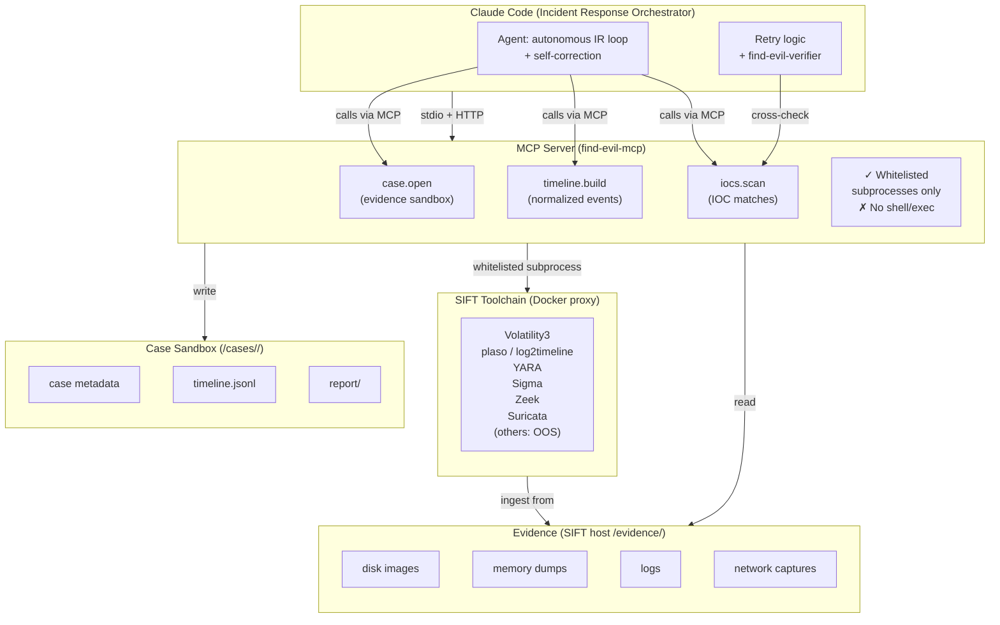
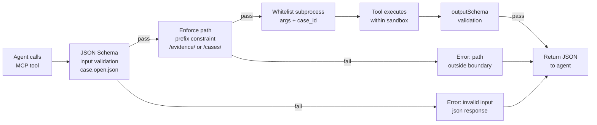

<!-- SPDX-License-Identifier: MIT -->

# FIND EVIL MCP Server — Architecture & Security Boundaries

**Version**: 0.1.0 (Phase 1-2 transition)  
**Status**: Phase 2 (9 tools: 3 Phase 1 + 6 Phase 2 implemented)  
**Phase 2 Status**: Schema complete; implementation pending (implementer phase 2)

## 1. System Architecture



## 2. Security Boundary Matrix

| Component | Allow | Deny | Evidence |
|-----------|-------|------|----------|
| **MCP input** | case_id (uuid pattern), path (regex `/evidence/` or `/cases/<id>`), enum params | shell, eval, arbitrary code, `/etc`, `/home`, outside sandbox | JSON Schema with `pattern`, `enum`, `oneOf` constraints |
| **MCP output** | structured JSON only, sandbox-relative paths | raw stdout, binary blobs, absolute paths outside `/cases/` | outputSchema enforces JSON, no `$ref` to external schemas |
| **File read** | `/evidence/*` (SIFT host perspective), `/cases/<case_id>/*` (sandbox) | `/etc`, `/root`, `/tmp` outside sandbox, network egress | case.open enforces `/evidence/` prefix; tool sandbox has read-only mount on evidence |
| **File write** | `/cases/<case_id>/report/` (structured JSON only) | anywhere else; direct write to evidence | report.append (Phase 2) restricted to report/ subdir |
| **Subprocess** | plaso, log2timeline, yara, sigma, volatility3, zeek, suricata (whitelist only) | bash, sh, python -c, perl, ruby -e, nc, curl | wrapper scripts call tools with fixed args + case_id, no user shell pass-through |
| **Network** | none (except SIFT Docker proxy localhost) | external HTTP/DNS/SSH | No socket syscalls in sandbox; proxy-only via Docker bridge |

## 3. Capability Handshake (Server Info)

When the orchestrator connects, the MCP server responds with this capability manifest:

```json
{
  "server_info": {
    "name": "find-evil-mcp",
    "version": "0.1.0",
    "description": "Forensic evidence processing orchestration via SIFT toolchain"
  },
  "capabilities": {
    "tools": [
      {
        "name": "case.open",
        "version": "0.1.0",
        "description": "Register and sandbox forensic evidence source",
        "schema_ref": "harness/find-evil/mcp-schema/case.open.json",
        "phase": "1"
      },
      {
        "name": "timeline.build",
        "version": "0.1.0",
        "description": "Construct normalized forensic timeline from case evidence",
        "schema_ref": "harness/find-evil/mcp-schema/timeline.build.json",
        "phase": "1"
      },
      {
        "name": "iocs.scan",
        "version": "0.1.0",
        "description": "Scan case evidence against YARA/Sigma IOC rules",
        "schema_ref": "harness/find-evil/mcp-schema/iocs.scan.json",
        "phase": "1"
      },
      {
        "name": "memory.process_list",
        "version": "0.1.0",
        "description": "Extract process list from memory dump (Volatility3)",
        "schema_ref": "harness/find-evil/mcp-schema/memory.process_list.json",
        "phase": "2"
      },
      {
        "name": "memory.malfind",
        "version": "0.1.0",
        "description": "Detect injected/suspicious memory regions (Volatility3)",
        "schema_ref": "harness/find-evil/mcp-schema/memory.malfind.json",
        "phase": "2"
      },
      {
        "name": "net.flow_summary",
        "version": "0.1.0",
        "description": "Extract and summarize network flows from PCAP (Zeek/Suricata)",
        "schema_ref": "harness/find-evil/mcp-schema/net.flow_summary.json",
        "phase": "2"
      },
      {
        "name": "log.query",
        "version": "0.1.0",
        "description": "Query forensic timeline and logs with structured filters",
        "schema_ref": "harness/find-evil/mcp-schema/log.query.json",
        "phase": "2"
      },
      {
        "name": "report.append",
        "version": "0.1.0",
        "description": "Append structured finding to case report with hash chain integrity",
        "schema_ref": "harness/find-evil/mcp-schema/report.append.json",
        "phase": "2"
      },
      {
        "name": "verify.cross_check",
        "version": "0.1.0",
        "description": "Re-verify findings against multiple sources for confidence scoring",
        "schema_ref": "harness/find-evil/mcp-schema/verify.cross_check.json",
        "phase": "2"
      }
    ],
    "constraints": {
      "sandbox": "/cases/<case_id>/",
      "evidence_host_path": "/evidence/",
      "no_shell": true,
      "no_eval": true,
      "json_only_output": true,
      "subprocess_whitelist": ["plaso", "log2timeline", "yara", "sigma", "volatility3", "zeek", "suricata"]
    }
  }
}
```

## 4. Input/Output Validation Flow



## 5. Phase 1 Tool Specifications

### 5.1 case.open (evidence sandbox)

**Purpose**: Register a forensic evidence source and create an isolated case workspace.

**Input constraints**:
- Exactly one of: `image_path`, `mem_path`, `pcap_path`, `logdir_path`
- All paths match regex `^/evidence/[a-zA-Z0-9._/-]+$` (SIFT host absolute)
- No symlink traversal or `..` sequences allowed

**Output**:
- `case_id`: UUID v4 (immutable case namespace)
- `sandbox_root`: `/cases/<case_id>/` (case working directory)
- `accepted_inputs`: array of {kind, path} for audit trail

**Side effects**:
- Creates `/cases/<case_id>/` directory tree (owned by orchestrator)
- Creates `/cases/<case_id>/report/` subdirectory for findings
- Registers case metadata in local registry (JSON file)

**Error handling**:
- If evidence source unreachable: return 404-equivalent JSON error
- If sandbox creation fails: return 500-equivalent JSON error
- All errors are structured JSON; no exception stack traces

### 5.2 timeline.build (normalized forensic timeline)

**Purpose**: De-duplicate and merge filesystem, memory, and log events into a canonical timeline.

**Input constraints**:
- `case_id`: must be valid UUID v4 from prior `case.open` call
- `source_filter`: enum {disk, memory, logs, network, all} (default: all)
- `since`, `until`: ISO 8601 timestamps (optional; filter events by time range)

**Output**:
- `timeline_path`: `/cases/<case_id>/timeline.jsonl` (JSON-Lines, one event per line)
- `event_count`: total events after de-duplication
- `tool_used`: enum {plaso, log2timeline}
- `generated_at`: ISO 8601 completion timestamp
- `sources_processed`: list of actual sources included

**JSON-Lines schema (per event)**:
```json
{
  "timestamp": "ISO 8601",
  "source": "disk|memory|logs|network",
  "event_type": "file_access|process_exec|network_conn|...",
  "description": "human-readable event summary",
  "artifacts": [{"type": "path|pid|ip", "value": "string"}],
  "severity": "info|low|medium|high"
}
```

**Side effects**:
- Writes `/cases/<case_id>/timeline.jsonl`
- Calls SIFT subprocess `plaso` or `log2timeline` with whitelisted args
- No direct file writes outside `/cases/<case_id>/`

### 5.3 iocs.scan (indicator-of-compromise detection)

**Purpose**: Scan case evidence against threat signatures (YARA rules or Sigma log detection rules).

**Input constraints**:
- `case_id`: valid UUID v4 from prior `case.open`
- `ruleset`: enum {yara_default, yara_custom, sigma}
  - `yara_default`: SIFT bundled YARA rules
  - `yara_custom`: user-supplied custom rules (uploaded via separate process; Phase 2)
  - `sigma`: log detection via Sigma rules
- `target_glob`: optional sandbox-relative glob pattern
  - Pattern must NOT start with `/` or contain `..`
  - Examples: `memory/*`, `disk_image.001`, `logs/**/*.txt`
  - Default: entire sandbox

**Output**:
- `scan_id`: UUID v4 (scan run identifier)
- `matches`: array of {rule, path, offset, severity, context}
  - `rule`: matched rule name
  - `path`: sandbox-relative path to matched file
  - `offset`: byte offset of match (0 if N/A)
  - `severity`: enum {info, low, medium, high, critical}
  - `context`: optional 256-byte snippet around match
- `scanned_files`: count of files examined
- `tool_used`: enum {yara, sigma}
- `generated_at`: ISO 8601 timestamp

**Side effects**:
- Calls SIFT subprocess `yara` or `sigma` with args: `--case_id <case_id> --ruleset <ruleset> [--target <glob>]`
- Reads `/cases/<case_id>/` and referenced `/evidence/` paths (read-only)
- No write operations

## 6. Phase 2 Tools (Schema Complete — Implementation Pending)

The following 6 tools were added in Phase 2 schema (2026-04-30). Implementation (subprocess integration) pending implementer phase 2 (2026-05-21 → 2026-06-01):

| Tool | Purpose | Key Input | Key Output | Subprocess |
|------|---------|-----------|------------|------------|
| `memory.process_list` | Extract process list from memory dump | case_id, kdbg_offset? | array of {pid, ppid, name, create_time, exit_time?, suspicious_flags[]} | volatility3 |
| `memory.malfind` | Detect injected/suspicious memory regions | case_id, pid? | array of {pid, vad_start, vad_end, protection, yara_hits[], severity} | volatility3 |
| `net.flow_summary` | Summarize network flows from PCAP | case_id, pcap_id, top_n? | array of {src_ip, dst_ip, src_port, dst_port, proto, bytes, packets, suspicious_flags[]} | zeek, suricata |
| `log.query` | Query timeline/logs with structured filters | case_id, q, source?, since?, until?, limit? | array of {timestamp, source, host?, user?, level?, message, raw_offset} | log2timeline, plaso-query, sigma |
| `report.append` | Append finding with hash chain integrity | case_id, finding{title, severity, narrative, evidence[], mitre_attack[]?} | {finding_id, appended_at, report_path, prev_hash, this_hash} | none (internal write only) |
| `verify.cross_check` | Re-verify finding via cross-check | case_id, finding_id, method? | {agreements[], disagreements[], confidence, verdict, tool_used[], generated_at} | none (internal read-only) |

All 6 Phase 2 schema files created in `harness/find-evil/mcp-schema/` with full input/output validation and security constraints.

## 7. Non-Goals & Out of Scope

- ❌ Shell or exec MCP tools (architectural constraint, not prompt guard)
- ❌ Arbitrary file read/write outside `/cases/<id>/` and `/evidence/`
- ❌ Generic subprocess wrappers (all subprocess calls whitelisted by name)
- ❌ Smart-contract analysis (FIND EVIL is malware DFIR, not DeFi audit)
- ❌ Cloud deployment or multi-tenant isolation (Phase 1 is local-only)
- ❌ GPU inference (NFR: CPU-only)

## 8. Validation & Testing

**Capability handshake test** (`make -C harness/find-evil mcp-conformance`):
1. Server reports correct tool names (9 tools), versions, phases
2. All 9 schema files validate against JSON Schema draft-07
3. No `$ref` to external or malicious schemas
4. `additionalProperties: false` on all input/output objects
5. Path patterns enforce sandbox boundaries (`/cases/<id>/`, `/evidence/`)
6. Subprocess whitelist enforced: plaso, log2timeline, yara, sigma, volatility3, zeek, suricata

**Phase 1 fixture test** (2026-05-20 — implementer responsibility):
- Load test disk image with known malware sample
- `case.open(image_path)` → case_id + sandbox_root
- `timeline.build(case_id)` → ≥10 events in timeline.jsonl
- `iocs.scan(case_id, ruleset="yara_default")` → ≥1 match from bundled YARA rules
- All outputs validate against outputSchema

**Phase 2 fixture test** (2026-06-01 — implementer responsibility):
- `memory.process_list(case_id)` → process array with timestamps and suspicion flags
- `memory.malfind(case_id)` → findings with VAD regions and YARA hits
- `net.flow_summary(case_id, pcap_id)` → flow array sorted by bytes, top_n limit enforced
- `log.query(case_id, q="malware")` → log hits with truncation flag, no shell injection
- `report.append(case_id, finding)` → finding_id + hash chain (prev_hash, this_hash)
- `verify.cross_check(case_id, finding_id)` → confidence score, verdict enum validation

## 9. Subprocess Execution Model

All SIFT tool invocations use `SiftRunner` (in `src/find_evil_mcp/sift_runner.py`):

- **Whitelist enforcement**: `BINARIES` dict maps logical names (plaso, yara, volatility3, zeek, suricata, sigma) to binary names. Only whitelisted tools execute.
- **Metacharacter rejection**: All args validated against forbidden set `{;|`$&<>` plus newlines and NUL}. Injection-unsafe args rejected before subprocess.run().
- **Timeout**: Default 120s per invocation. Timeout → SiftResult with returncode=-1 and stderr="TIMEOUT after Xs".
- **No shell**: All calls use `subprocess.run(..., shell=False)`, preventing eval and shell metachar expansion.
- **Monkeypatch pattern for tests**: Handlers instantiate module-level `runner = SiftRunner()` singleton. Tests monkeypatch `find_evil_mcp.tools.<x>.runner` to mock the runner without spawning subprocess.
- **is_available() shortcut**: Before subprocess invocation, check `runner.is_available(tool)` via `shutil.which()`. If unavailable, handler returns empty result (not error).

Parsers are kept separate (`_parse_<tool>()` functions) so unit tests can fuzz them against curated stdout samples without subprocess overhead.

## 10. References

- **Spec**: `plans/ITEM-212-find-evil/spec.md`
- **Gates**: `harness/find-evil/gates.yaml` (phase_1.required.mcp_capability_handshake)
- **Schema directory**: `harness/find-evil/mcp-schema/` (3 Phase 1 tools; 6 Phase 2 tools)
- **SIFT Docker proxy**: `harness/find-evil/docker-compose.yml`
- **Secrets policy**: `harness/find-evil/secrets.policy.md`
- **SiftRunner module**: `src/find_evil_mcp/sift_runner.py`
- **Tests**: `tests/test_detector.py` (34 unit tests for parsers and handlers)
